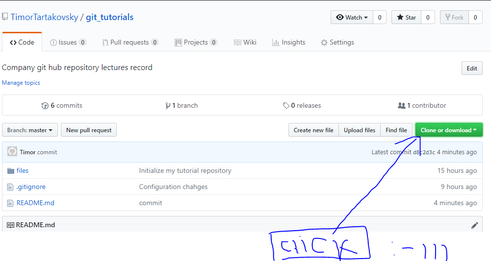
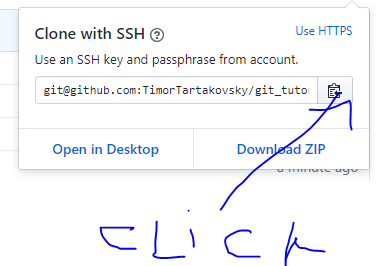

# GIT tutorial for a company needs


## Configuration 

[link to Git!](https://git-scm.com/)

Configure your credentials.

```
IN BASH

git config --global user.name "Your name"
git config --global user.email "Your email"
```


### Git core editor

Downnload Notepad++ editor as a commonly used.


```
IN BASH

alias npp="notepad++ -multiInst -nosession"
git config core.editor "notepad++ -multiInst -nosession"
```


### To look on the global config

```
IN BASH

git config --global -e
```

to leave the configuration press: 'shift' + ':' -> 'q' -> 'enter'<br />


### This tool is optional it allows you to work with merged files (pre-merge) and compare different commits

[to load it click here!](https://www.perforce.com/downloads/helix#clients)

find p4merge soft and download it.

```
IN BASH

git config --global diff.tool p4merge
git config --global difftool.p4merge.path "C:/Program Files/Perforce/p4merge.exe"
git config --global difftool.prompt false

git config --global merge.tool p4merge
git config --global mergetool.p4merge.path "C:/Program Files/Perforce/p4merge.exe"
git config --global mergetool.prompt false

```
<br />
Git state devided on three local sections and one remoted: 

"Working directory" - The files that were changed do the development process but untracked yet. <br />
"Staging directory" - The files that were accepted to a future commit 
"Tracked directory" - Comitted files

```
git status
``` 
this command shows  untracked files.
<br />

```
git add <file/s name>
git stage <file/s name>
```
this command prepare files to be tracked
<br />
```
git add .
```
allow to accept all the files
<br />

```
git commit -m "<T.Tartakovsky> #US_number 'Store the passed git tutorials' reviewer: Itamar"
```
This way we may do one commit and to commit all the added files run this
```
git commit
```
Then the multi commit window is opened and editable. To execute it press 'ctrl' + 's' -> 'ctrl' + 'w'
<br />

To see GIT inner folder:
```
cd .git
tree
```
It will show construction of a git tree.
<br />

```
rm -rf <folder name>
```
It will delete the file or folder
<br />

```
git log
git show
```
This too commands allows you to see details of the commits
<br />

```
git ls-files
```
Shows all the racked files.
<br />

```
git commit -am "Commit message"
```
It will track the files and then commit them.
<br />

```
git reset HEAD <file name>
```
It will unstage already staged file
<br />

```
git checkout <file name>
```
reset file on the state that was before it was modified.
<br />

```
git log --oneline --graph --decorate --all
```
Run this command to better see a tracking trace of commits.
<br />

```
git config --global alias.hist "log --oneline --graph --decorate --all"
```
It will help to shortcut this command :
```
git hist - short way to call it.
```
<br />

```
git config --global --list
```
This command will show you all the global configurations you have.
<br />

```
git hist -- <file name>
```
This showing the history of the particular file.
<br />

```
git mv <old file name> <new file name>
```
To change the file name, use this command.<br />
Then commit it.

```
git add -u
```
This command updates files before adding in to a stage.  (used in case some files changed the extension ....)
<br />

```
git add -A
```
adds all the modifications.


## Barnching and Merging

'HEAD' the last commit?

Answer. HEAD is a reference to the last commit in the currently check-out branch. You can think of the HEAD as the "current branch". <br />
When you switch branches with git checkout, the HEAD revision changes to point to the tip of the new branch. <br />
You can see what HEAD points to by doing: cat .git/HEAD. <br />

To manage a branches on your localhost just run the following commands: 
```
git branch
```
It will show you branch you working on  colored 'green' and other white in default configuration.
<br />

To create a new branch this command will help you. 
```
git checkout -b
```
<br />

To move from one branch to another: 
```
git checkout <branch name>
```
<br />

## Merging branches

git-merge - Join two or more development histories together. <br />
Incorporates changes from the named commits (since the time their histories diverged from the current branch) into the current branch. This command is used by git pull to incorporate changes from another repository and can be used by hand to merge changes from one branch into another.

Assume the following history exists and the current branch is "master":

```
 		A---B---C topic
	 /
    D---E---F---G master
```
Then "git merge topic" will replay the changes made on the topic branch since it diverged from master (i.e., E) until its current commit (C) on top of master, and record the result in a new commit along with the names of the two parent commits and a log message from the user describing the changes.

```
	  A---B---C topic
	 /         \
    D---E---F---G---H master
```

The second syntax ("git merge --abort") can only be run after the merge has resulted in conflicts. git merge --abort will abort the merge process and try to reconstruct the pre-merge state. However, if there were uncommitted changes when the merge started (and especially if those changes were further modified after the merge was started), git merge --abort will in some cases be unable to reconstruct the original (pre-merge) changes. Therefore:

__Warning__: Running git merge with non-trivial uncommitted changes is discouraged: while possible, it may leave you in a state that is hard to back out of in the case of a conflict.

The third syntax ("git merge --continue") can only be run after the merge has resulted in conflicts.

Now several commands to practice: 

```
git merge <branch name with which current branch will be merged>
```
Remember, choosed branch will be merged with the current branch. <br />
In case two branches didn't warked on the same places in code, - fast-forward mode will be used.
<br >

```
git branch -d <branch name 'hash code'>
```
__Delete__ a branch 
<br />

```
git branch -a
```
Show all the branches.
<br />

```
cat <file name>
```
Shows the file in VIM to see what is inside the file. <br />

In case when local branches have the same files merged, like shown above

```
git mergetool
```
mergetool will help you to reconstruct the files and make conflicted merge being less painfull (or just use your IDE)

## GIT TAG

Like most VCSs, Git has the ability to tag specific points in history as being important. Typically people use this functionality to mark release points (v1.0, and so on). In this section, you’ll learn how to list the available tags, how to create new tags, and what the different types of tags are. <br /><br />

It usefull when you want to put an accent on one specific commit (let sey the commit that has the most update changes without conflicts)<br />

### Commands: 

```
git tag -a <the name of the tag> -m "commit message"
```
It does the pointer with tag in that particular commit which could be fined easily after.<br />

```
git tag
git tag --all 
```
Shows a tags. 
<br />
```
git show <name of the tag>
```
Shows a commit with that tag. 
<br />

```
git stash list
```
shows all stash.<br />

## Reset

Git reset is a less distructive command then checkout. It allows to move HEAD from one point to another.<br />
It has 3 options:

1. '--soft' is low distructive
2. 'hard' distructive
3. 'mixed' - is recursive
<br />

example: 
```
git reset <commit number> --soft
```
This command chnaged position of the head.
<br />

```
git ref log
```
Shows all the actions made on that branch.<br />

## Repositories

How to clone a repository: 

Step 1.

<br />
Step 2.



```
git clone git@github.com:TimorTartakovsky/git_tutorials.git
```
This command will fetch all the content of that repository in a default repo name given inside. 
<br />

```
git clone git@github.com:TimorTartakovsky/git_tutorials.git <name you gave to repository>
```
Will fetch all the content into specified folder.
<br />

To push something to a remote repository use this command: 

```
git push origin <branch you want to push in remote repo>
```
<br />

```
git config --global push.default simple
```

This is an optional configuration. Point the git how to push if you didn't specified the branch you want to push to.
<br />

## Fetch and Pull

We should understand that the repository is only the file system feature allows you to publish your code online.
<br />
In case you have changes of the same files both localy and remotely , then we have to decide which way we want to get the data from remoted branch to a localhost.
<br />
 What is 'pull' it does a fetch before getting data (so it is both together 'fetch' and 'pull')
 <br />
 In case if the contant is not able to be migrate not -fast-forward way, not auto-merge, then we have to first 'fetch' menually and then pull.
 <br />

 ```
 git fetch
 git pull
 ```
<br />

### Remoted

```
git remote -v
origin  git@github.com:TimorTartakovsky/git_tutorials.git (fetch)
origin  git@github.com:TimorTartakovsky/git_tutorials.git (push)
```
Shows the refs on remoted repo;
<br />

To update it:

```
git remote set-url origin <example: git@github.com:TimorTartakovsky/git_tutorials.git>
```
<br />

```
git remote show
```
Information about remoted refs.
<br />


